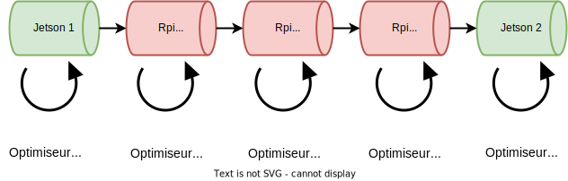
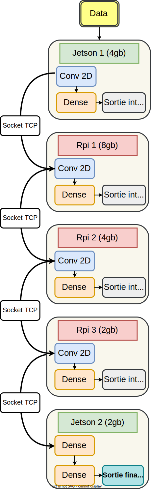

# Serveur Context

This directory is dedicated to the implementation of the mcmc optimizer on 5 semi-independent processes. Find beside a diagram that summarizes this architecture.

- [Serveur Context](#serveur-context)
  - [Context](#context)
    - [Why?](#why)
    - [How does it work?](#how-does-it-work)
  - [How to reproduce?](#how-to-reproduce)
    - [1. If you have access to the GreenAI cluster](#1-if-you-have-access-to-the-greenai-cluster)
      - [Quick, I want the solution](#quick-i-want-the-solution)
      - [Detailed solution](#detailed-solution)
    - [2. If you don't have access to the GreenAI cluster](#2-if-you-dont-have-access-to-the-greenai-cluster)
  - [Notes](#notes)

## Context

### Why?

- write low-consumption networks,
- use optimized hardware to reduce the consumption of the life cycle of an algorithm.

### How does it work?

We have here 5, each of them composes the neural network formed by the set. An MCMC optimizer runs on each device, independently of the decisions made by the others.

Two devices have a role that stands out from the others: 
- The first device is in charge of giving the data sending rate, it is the one that has the raw data stored in memory.
- The last device represents the end of the network and gives the classification of each received data.

Each intermediate device contains a classifier to visualize the evolution of the precision of each sub-model. But also to have an early-exit application perspective.

We can see beside how we designed each model on our architecture.

The communication between the devices is one-way and linear. We, therefore, use TCP client-server communication between the devices. For more information on TCP sockets: [find more here](https://fr.wikipedia.org/wiki/Transmission_Control_Protocol)

<!-- A COMPLETER !!! -->

## How to reproduce?

### 1. If you have access to the GreenAI cluster

**Common start**: 
- Clone this git on your computer
- run `server/update_scripts.sh` from the server directory to copy each script on its dedicated device
- run `monitoring/mounting_data.sh` from the monitoring directory to mount each log file on its dedicated directory in order to run the streamlit dashboard on your own computer

#### Quick, I want the solution

- Start an ssh connexion on each device with the gdev user. 
- update the `~/deep_learning_mcmc` directory with `git pull` and run `pip install .`
- Go to `~/script`
- run `python3 run.py` following this order: p8, p2, j4, p4, j2
- Start the streamlit dashboard on your own computer by running `streamlit run monitoring/Home.py`  
- enjoy!

#### Detailed solution

The implementation of the solution is mainly based on python3.7, a minimal version for the proper functioning of the asynchronous aspect of the network. 

The asynchronous management of tasks and TCP connections between devices is enabled by the [asyncio library](https://docs.python.org/3/library/asyncio.html). 

Find below configuration for each device:
> J4 - **model configuration**
>  - batch size: 64
>  - number of filter: 32
>  - size of filter: 11*11
>  - stride: 3
>  - padding: 0
>  - loss: cross entropy
> 
> **connexion configuration**
> - type: client 
> - related to: p8

> P8 - **model configuration**
>  - batch size: 1
>  - number of filter: 64
>  - size of filter: 11*11
>  - stride: 0
>  - padding: 5
>  - loss: cross entropy
> 
> **connexion configuration**
> - type: server 
> - related to: j4 & p4

> P4 - **model configuration**
>  - batch size: 1
>  - number of filter: 64
>  - size of filter: 11*11
>  - stride: 0
>  - padding: 5
>  - loss: cross entropy
> 
> **connexion configuration**
> - type: client 
> - related to: p8 & p2

> P2 - **model configuration**
>  - batch size: 1
>  - number of filter: 64
>  - size of filter: 11*11
>  - stride: 0
>  - padding: 5
>  - loss: cross entropy
> 
> **connexion configuration**
> - type: server 
> - related to: p4 & j2

> J2 - **model configuration**
>  - batch size: 1
>  - loss: cross entropy
> 
> **connexion configuration**
> - type: client 
> - related to: p2

### 2. If you don't have access to the GreenAI cluster

In progress....

## Notes

- Regarding a Jetson Nano 4GB, fan must be started/stopped manually using the `~/startfan.sh` and `~/stopfan.sh` scripts.
- Regarding a Jetson Nano 4GB, to exploit the max power of the board: `sudo nvpmodel -m 0` (Already running on our device)
- Current version doesn't use any sparsity or Binary operation
- Current version hasn't test set 
